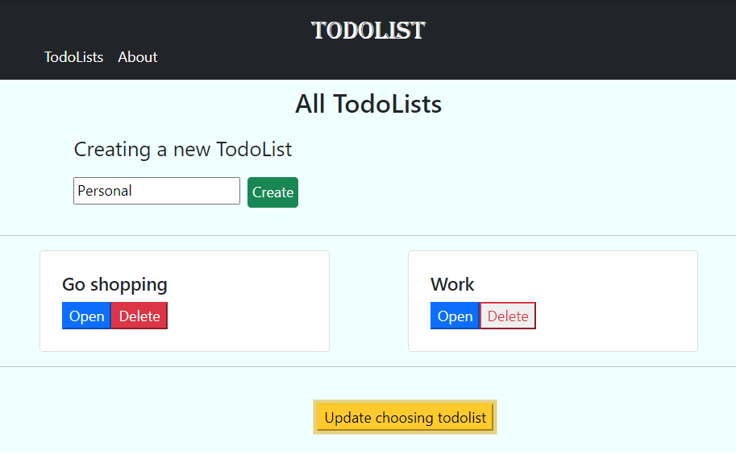
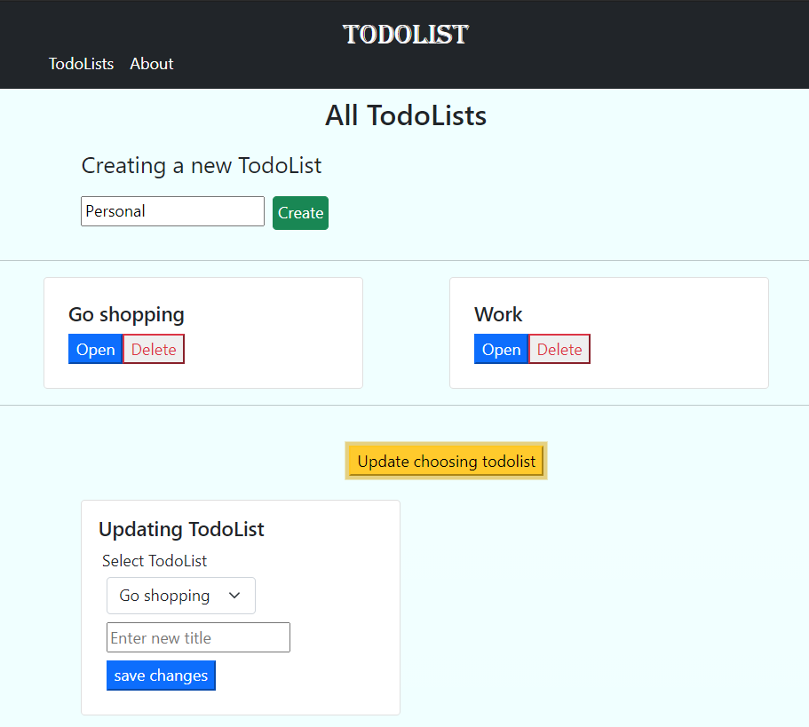
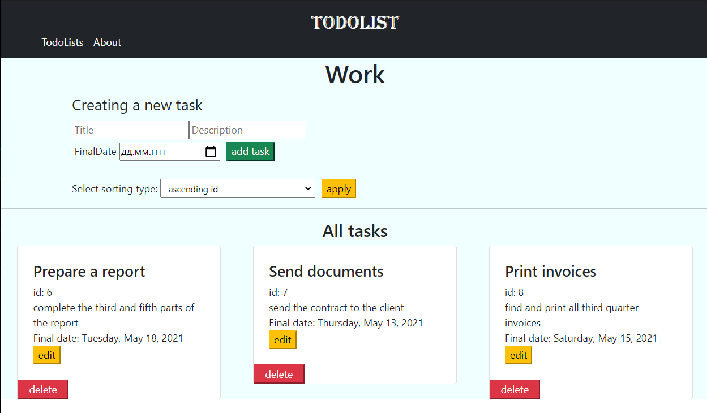
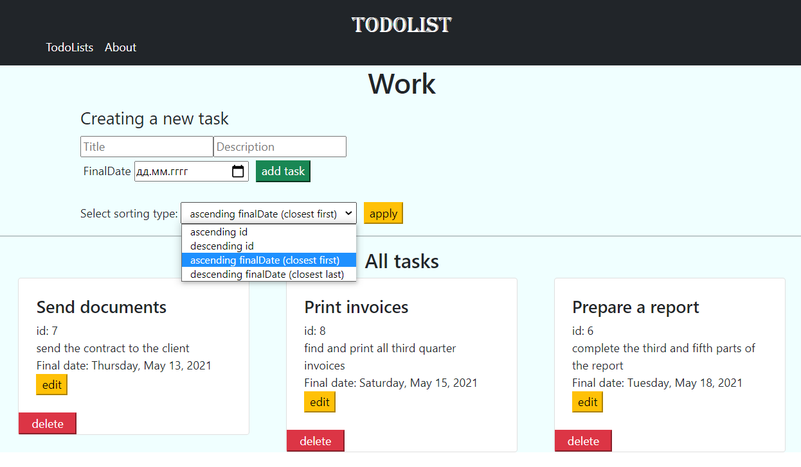
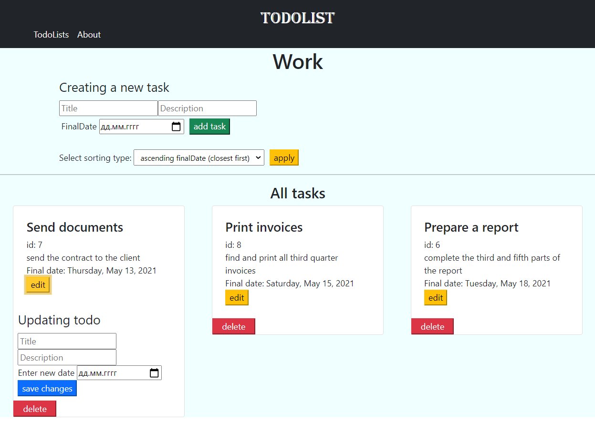

# Todolist

[](https://hitsofcode.com/view/github/anrysliusar/todolist)
[](https://github.com/anrysliusar/todolist/graphs/commit-activity)
<br>
It allows users to create new To-Do lists and add tasks to them. 
It is also possible to sort tasks in the lists by different fields
<br>

## Stack

- [Spring Framework](https://spring.io/)
- [Angular](https://angular.io/)
- [MySQL](https://www.mysql.com/)
- [Hibernate](https://hibernate.org/)

## Requirements

For building and running the application you need:

- [JDK 1.8](http://www.oracle.com/technetwork/java/javase/downloads/jdk8-downloads-2133151.html)
- [Maven 4](https://maven.apache.org)
- [NodeJS](https://nodejs.org)
- [NPM](https://www.npmjs.com/)

To build the project simply run this command in the root directory: 
```shell
mvn clean install 
```
There are several ways to run a Spring Boot application on your local machine. 
One way is to execute the `main` method in the `TodolistApplication` class from your IDE 
and go to `http://localhost:8080`. 

Alternatively you can use the 
[Spring Boot Maven plugin](https://docs.spring.io/spring-boot/docs/current/reference/html/build-tool-plugins-maven-plugin.html) like so:

```shell
mvn spring-boot:run
```

To run Angular application on your local machine 
you can go to the Angular root directory and run:

```shell
ng serve --open
```
This will automatically open `http://localhost:4200` in your browser.

## Screenshots of the program






